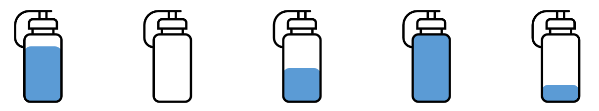
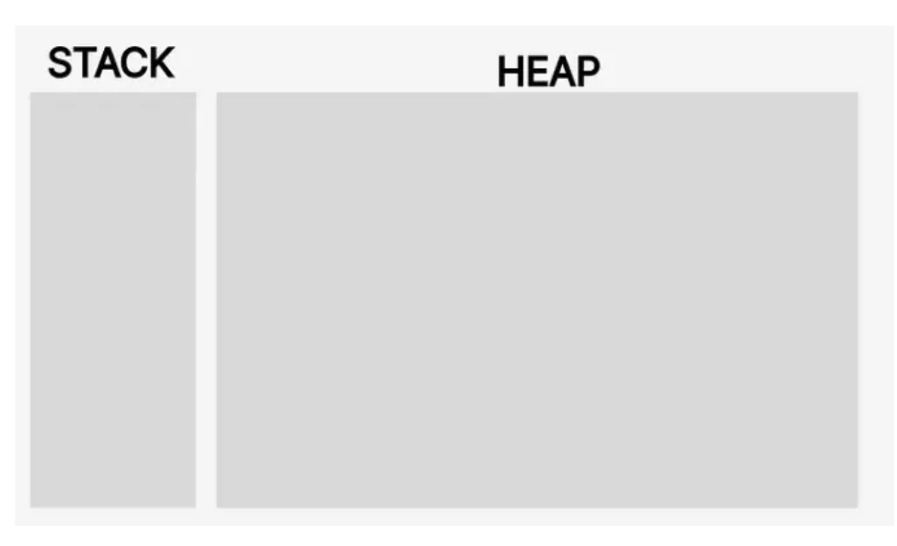
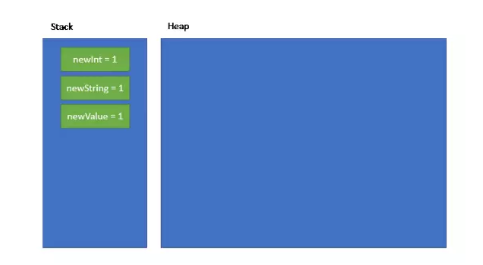
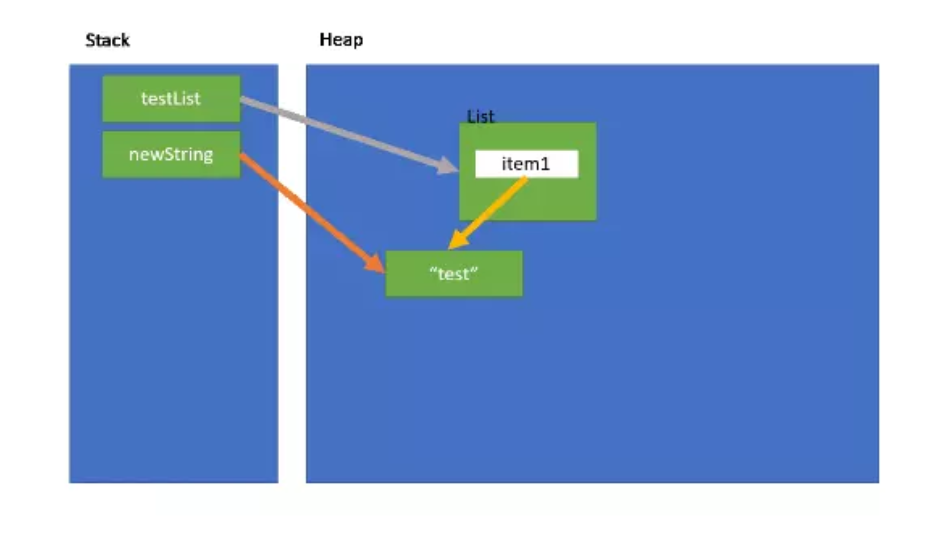
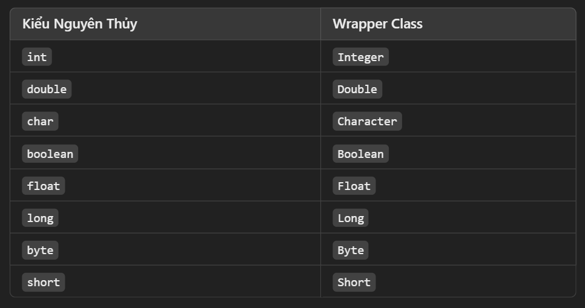
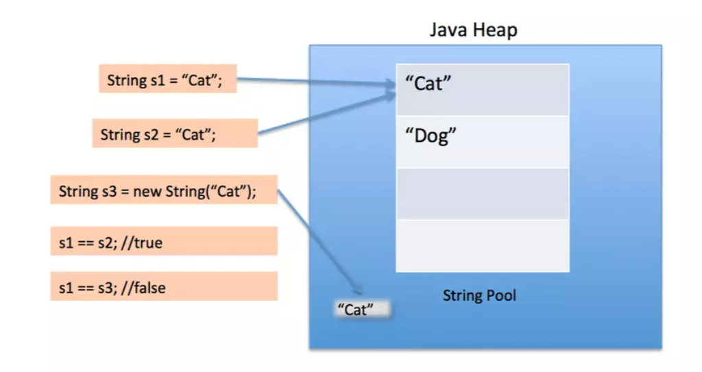

***TÌM HIỂU SÂU VỀ OBJECT***

**1.Object là gì?**
- **Object** là những thứ xuất hiện xung quanh chúng ta trong thế giới thực.Bất kể thứ gì từ bàn, ghế đều là các object. Những chiếc ghế giống nhau nhưng không phải là 1 object. Chúng là những object khác nhau nhưng mà đều là cái ghế.
- Mỗi cái ghế là một vật thể riêng biêt, có các tính chất và sự tồn tại riêng. Ví dụ mình cưa chân 1 cái ghế thì, cái ghế còn lại vẫn bình thường

> Các object có thể có những tính chất giống nhau, ví dụ như 2 bình đều đang chứa nước. Tuy nhiên mỗi bình lại có những thông số về các tính chất khác nhau: khối lượng, thể tích nước bên trong nó. Đổ đầy nước vào bình đầu tiên không có nghĩa là bình thứ 2 cũng đầy. Do đó trạng thái hiện tại(current state) của mỗi object đều độc lập với nhau dù đều là bình nước.

-Ngoài lượng nước, bình còn bao gồm nhiều thông số khác như khối lượng, màu sắc, kích cỡ, chất liệu,... Một vài thông số không thể thay đổi, một vài có thể bị thay đổi trong quá trình sử dụng bình nước(object lifecycle).



- Trong lập trình, các thông số được gọi với nhiều cách khác nhau như property, attribute, state, field,.. để diễn tả đặc trưng của đối tượng
- Bên cạnh đó, ta có thể thêm các hành động tương tác với object, gọi là method/behaviour/function/...
- Về cơ bản, nếu 1 đối tượng có độ phức tạp cao thì có thể chia thành nhiều đối tượng nhỏ hơn và tập hợp chúng lại với nhau (composition)

>Một object có thể bao gồm một hoặc nhiều object khác, nhưng object **không phải class**

**2. Object được lưu thế nào trong Java?**
- Đầu tiên chúng ta sẽ tìm hiểu là trong JVM, bộ nhớ được chia ra thành hai vùng: Stack memory và Heap memory.



>**Stack là gì?**
- Trong JVM, ngăn xếp là cách tiếp cận rất hiệu quả để quản lý bộ nhớ và không chỉ một mà mọi luồng đều có vùng ngăn xếp riêng. Trong Stack, các trường hợp được khởi tạo lần lượt được thêm vào bộ nhớ giống như các chúng ta xếp chông nó lên nha. Stack không đủ lớn để lưu trữ các đối tượng nên những gì được lưu trữ và xử lý tại vùng nhớ này là kiểu nguyên thỷ (primitive types) và con trỏ đối tượng, chúng sẽ được lưu trữ trực tiếp thay vì toàn bộ đối tượng.



-> Nếu một tham chiếu không trỏ đến bất kì đối tượng nào, giá trị của tham chiếu đó có thể là null, và null sẽ được lưu trên **Stack**

- Thêm nữa, mỗi khi một phương thức được gọi, một khung dữ liệu mới (frame) được tọ và đẩy lên đỉnh ngăn xếp (call stack). Khung dữ liệu này chưa thông tin về biến cục bộ, địa chỉ trả về và các thông tin khác liên quan đến thực thi hàm. Khi hàm thực hiện xong, khung bộ nhớ cho hàm sẽ bị loại bỏ, và giải phóng bộ nhớ trong Stack

>**Heap là gi?**
- Có thể thấy, kích thước của Heap lớn hơn Stack vì Heap là vùng chính để chứa các **đối tượng (object)**. Mọi đối tượng được tạo ra sẽ được lưu trong Heap và tham chiếu của nó được giữ trong Stack.



- Java Heap Memory là bộ nhớ được sử dụng ở runtime để lưu các Objects. Bất cứ khi nào ở đâu trong chương trình tạo Object thì nó sẽ được lưu trong Heap(thực thi toán tử New).
- Các objects trong Heap đều được truy cập bởi tất cả các nơi trong ứng dụng.

**3. Wrapper class**
- là lớp bao quanh( hoặc "gói") các kiểu dữ liệu nguyên thủy, như int, double, char, và cung cấp cho chúng các khả năng giống như các đối tượng. Java cung cấp một lớp bao riêng cho mỗi kiểu dữ liệu ngyên thủy.



-> Tại sao cần Wrapper Class?
- Wrapper class rất cần thiết vì Java là ngôn ngữ lập trình hướng đối tượng, nhưng các kiểu nguyên thủy không thể sử dụng như đối tượng. Lý do cụ thể mà Wrapper class hữu ích:
    + Tính đồng nhất trong Collections: Cấu trúc dữ liệu thuộc Java Collection(ArayList, LinkedList, HashSet,...) chỉ có thể chứa đối tượng, không thể chứa kiểu dữ liệu nguyên thủy. Wrapper class cho phép chúng ta đưa kiểu nguyên thủy vào Collection bằng cách chuyển đổi thành đối tượng tương ứng
    + Xử lý null và các giá trị đặc biệt: Các Wrapper class có thể có giá trị null, còn kiểu nguyên thủy thì không thể. Điều này giúp dễ dàng kiểm tra giá trị rỗng hoặc chưa được gán, đặc biệt hữu ích khi làm việc với dữ liệu và có thể không có giá trị rõ ràng
> Nhờ Wrapper class, Java linh hoạt hơn khi xử lý dữ liệu kiểu nguyên thủy trong các tình huống yêu cầu đối tượng

**4. Autoboxing và unboxing**
> **Autoboxing** và **Unboxing** là hai cơ chế tự động trong Java cho phép chuyển đổi giữa các kiểu nguyên thủy như int, float,... và các Wrapper Class tương ứng như Integer, Float,...

>***Autoboxing*** 
- là quá trình Java tự động chuyển một giá trị kiểu nguyên thủy thành một đối tượng của Wrapper Class tương ứng
- Điều này xảy ra khi gán một giá trị nguyên thủy vào một biến thuộc kiểu lớp bao bọc hoặc khi thêm kiểu nguyên thủy vảo một Collection yêu cầu đối tượng.
-> Ví dụ về **Autoboxing**:
```java
Integer number = 5;
ArrayList<Integer> numbers = new ArrayList<>();
numbers.add(10);
```
>Ở ví dụ trên, 5 và 10 là các giá trị nguyên thủy(int), nhưng Java tự động chuyển chúng thành Integer để phù hợp với kiểu dữ liệu của number và ArrayList

>***Unboxing***
- Là quá trình Java tự động chuyển một đối tượng của Wrapper Class trở lại thành kiểu nguyên thủy tương ứng
- Unboxing thường xảy ra khi sử dụng một giá trị của Wrapper Class ở vị trí mà một giá trị nguyên thủy yêu cầu
-> Ví dụ về **Unboxing**:
```java
Integer number = 5;
int result = num + 10// Integer -> int
```
- Trong ví dụ trên, num là một đối tượng Integer, nhưng khi num tham gia vào phép tính num+10, Java tự động chuyển đổi num thành int để thực hiện phép toán.

**Cách hoạt dộng của Autoboxing và Unboxing**
- Khi Java thực hiện Autoboxing, nó tạo ra một đối tượng Wrapper Class mới hoặc tái sử dụng các giá trị được đóng gói trước đó
- Khi Java thực hiện Unboxing, nó truy xuất giá trị nguyên thủy từ đối tượng của lớp bao bọc.

**Lợi ích của Autoboxing và Unboxing**
- Không phải chuyển đổi giữa kiểu nguyên thủy và đối tượng một cách thủ công
- Auto-boxing giúp cho các kiểu nguyên thủy có thể được sử dụng với các Collection và Generics của Java, vốn chỉ chấp nhận các kiểu đối tượng.

>Ví dụ minh họa **Auto-boxing** và **Unboxing**:

```java
public class Example{
    public static void main(String[] args){
        // Auto_boxing
        Integer number = 100;// int -> Integer

        //Unboxing
        int result = num + 50;

    }
}
```

**5. String vs StringBuilder**
**I. String:**
- Bất biến: đối tượng String không thể thay đổi sau khi được khởi tạo. Mọi thao tác sửa đổi như nối chuỗi, thay thế kí tự sẽ tạo ra một đối tượng String mới và đối tượng cũ vẫn giữ nguyên.
- Hiệu suất thấp khi thay đổi nhiều vì String là bất biến, mỗi thao tác thay đổi sẽ tạo ra một đối tượng mới, làm tiêu tốn bộ nhớ và thời gian khi có nhiều thay đổi liên tiếp trên chuỗi
- Dùng cho dữ liệu ít thay đổi: String thích hợp cho các chuỗi kí tự không yêu cầu thay đổi thường xuyên

**II. StringBuilder:**
- Có thể thay đổi: Stringbuilder cho phép thay đổi nội dung của chuỗi mà không tạo ra đối tượng mới, vì thế nó rất hiệu quả về mặt bộ nhớ và thời gian
- Hiệu suất cao khi thao tác nhiều: vì khi cần thực hiện nhiều thao tác nối, chèn, hoặc thay thế ký tự, nó chỉ làm thay đổi đối tượng hiện tại mà không cần tạo đối tượng mới
- Không đồng bộ: StringBuilder không đồng bộ, nên không an toàn với các thao tác đồng thời

```java
StringBuilder word = new StringBuilder("Hello");
word.append(" World");
System.out.println(word.toString()); // in ra "Hello World"
```

>-> So sánh **hiệu suất**: khi thực hiện các thao tác nối hoặc sửa đổi chuỗi trong vòng lặp lớn, StringBuilder vượt trội hơn String



**6. Equals, toán tử == và hashCode**
- **Toán tử == : có 2 cách so sánh**
    + Nếu là đối tượng: so sánh địa chỉ ô nhớ (reference): khi dùng  == để so sánh 2 đổi tượng, Java sẽ kiểm tra chúng có trỏ tới cùng một địa chỉ trong bộ nhớ hay không
    + Nếu là biến nguyên thủy: Đối với các kiểu dữ liệu nguyên thủy như(int, float,..) == so sánh giá trị thực tế của chúng.
```java
String string1 = new String("Khanh");
String string2 = new String("Khanh");

System.out.println(string1 == string2) //false vì là 2 đối tượng khác nhau
```
-**Phương thức equals():** Kiểm tra xem 2 đối tượng có nội dung bằng nhau hay không, tùy thuộc vào cách định nghĩa phương thức này.

```java
int a = 5;
int b = 5;
System.out.println(a.equals(b)) //lỗi biên dịch vì không thể sử dụng equals cho biến nguyên thủy

Integer c = new Integer(5);
Integer d = new Integer(5);
System.out.println(c.equals(d)) //true vì sử dụng wrapper class chuyển biến nguyên thủy thành đối tượng và equals() có thể so sánh được nội dung của 2 đối tượng
```

-**hashCode:** là một phần quan trọng của việc quản lý các đối tượng và rất hữu ích trong việc tối ưu hóa hiệ suất của các cấu trúc dữ liệu như HashMap, HashSet, và HashTable
- Ý nghĩa:
    + Phương thức hashCode() trả về một giá trị nguyên(int) đại diện cho giá trị của đối tượng. Giá trị này thường được sử dụng để xác địn vị trí lưu trữ của đối tượng trong các cấu trúc dữ liệu như bảng băm.

- Quy tắc hashCode:
    + Hai đối tượng bằng nhau phải có **hashCode giống nhau** , nếu hai đối tượng a và b bằng nhau thông qua phương thức equals(), thì a.hashCode() phải bằng b.hashCode().
    + Không cần phải ngược lại: Ngược lại không phải lúc nào cũng đúng. Hai đối tượng khác nha có thể có cùng một giá trị hashCode, điều này được gọi là "collision" (va chạm);

- Cài đặt hashCode():
```java
class Person {
    private String name;
    private int age;

    public Person(String name, int age) {
        this.name = name;
        this.age = age;
    }

    @Override
    public boolean equals(Object obj) {
        if (this == obj) return true;
        if (!(obj instanceof Person)) return false;
        Person other = (Person) obj;
        return name.equals(other.name) && age == other.age;
    }

    @Override
    public int hashCode() {
        int result = name.hashCode(); // Sử dụng hashCode của trường name
        result = 31 * result + age;   // Kết hợp với hashCode của age
        return result;
    }
}

```

**7. Cách Java truyền tham số, pass by value, tại sao pass by value mà String lại thay đổi được?**
- Java luôn sử dụng pass by value: Tất cả các tham số đều được truyền dưới dạng bản sao.
- Đối với kiểu nguyên thủy: Bản sao giá trị được truyền, vì vậy các thay đổi trong phương thức không ảnh hưởng đến biến gốc.
- Đối với đối tượng (như String): Bản sao tham chiếu được truyền, nhưng do String là bất biến (immutable), nên không có sự thay đổi nào xảy ra trên đối tượng gốc. Khi bạn "thay đổi" một String, thực chất bạn đang tạo ra một đối tượng mới và tham chiếu đến đối tượng đó.

**8. Các khái niệm cơ bản về Garbage Collector**
- Garbage Collection là gì?
    + là quá trình tự động thu hồi bộ nhớ cả các đối tượng không còn được sử dụng trong chương trình. Điều này giúp ngăn ngừa rò rỉ bộ nhớ và giải phóng không gian cho các đối tượng mới

- Tại sao cần Garbage Collection?
    + trong Java không cần phải quản lý bộ nhớ thủ công như C/C++. Garbage Collector tự động giải phóng bộ nhớ cho các đối tượng không còn tham chiếu nào đến chúng, giúp dễ dàng hơn trong việc phát triển ứng dụng mà không lo lắng về việc rò rỉ bộ nhớ

- Cách hoạt động của Garbage Collector:
    + Theo dõi tham chiếu: Garbage Collector theo dõi các đối tượng trong bộ nhớ. Khi không còn tham chiếu nào đến một đối tượng, nó sẽ được coi là "rác" và có thể được thu hồi
    + Phân đoạn bộ nhớ: Bộ nhớ trong Java thừng được chia thành các khu vực khác nhau như Stack và Heap. Garbage Collector chủ yếu hoạt động trên Heap memory, nơi các đối tượng tạo ra

- Các thuật toán Garbage Collector:
    + Mark and Sweep: là một trong những phương pháp phổ biến nhất, gồm 2 bước: **Mark** để đánh dấu tất cả đối tượng còn sống(có tham chiếu); còn **Sweep** dùng để xóa tất cả các đối tượng không được đánh dấu
    + Generational Garbage Collection: Bộ nhớ chia thành các thế hệ( Young & Old). **Young** chứa các đối tượng mới tạo ra, GC sẽ được thực hiện thường xuyên ở đây; **Old** chưa các đối tượng sống lâu hơn và GC ít ở khu vực này

- Phân loại GC:
    + Serial GC: sử dụng một luồng để thực hiện GC. Phù hợp cho ứng dụng nhỏ hoặc có bộ nhớ hạn chế
    + Parallel GC: Sử dụng nhiều luồng để thực hiện GC. Tăng tốc độ thu hồi bộ nhớ cho các ứng dụng lớn
    + Concurrent Mark-Sweep (CMS) GC: Thực hiện việc đánh dấu các đối tượng sống mà không làm dừng ứng dụng
    + G1 GC(Garbage first): Chia bộ nhớ thành nhiều vùng nhỏ và thực hiện thu hồi bộ nhớ một cách hiệu quả hơn, đặc biệt cho ứng dụng lớn

>->Garbage Collector là một phần thiết yếu trong Java, giúp tự động quản lý bộ nhớ và ngăn ngừa rò rỉ bộ nhớ. việc hiểu rõ cách thực hoạt động của nó có thể giúp dev tối ưu hóa ứng dụng và cải thiện hiệu suất.