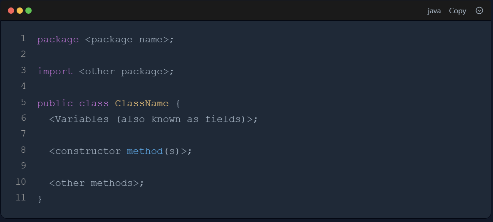
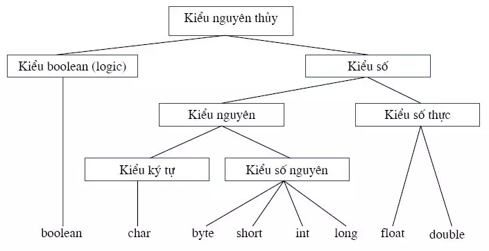
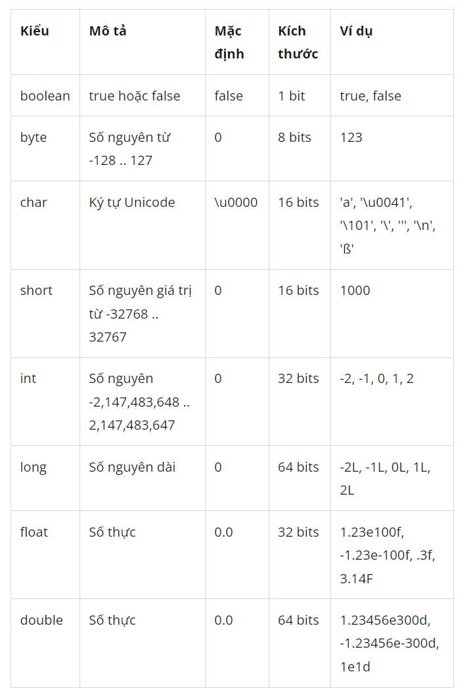
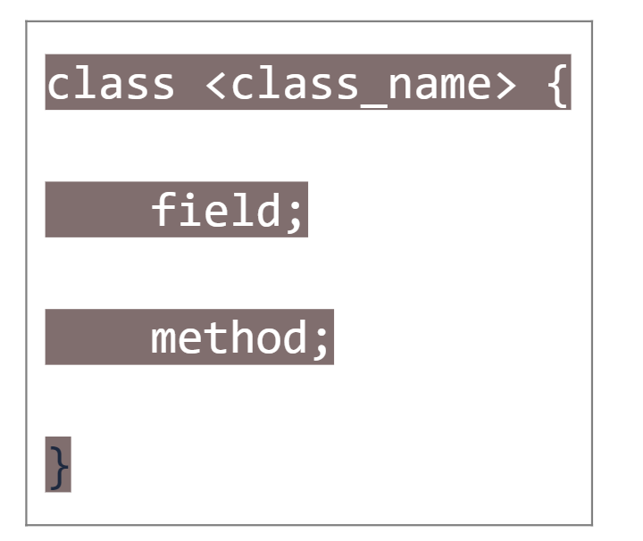
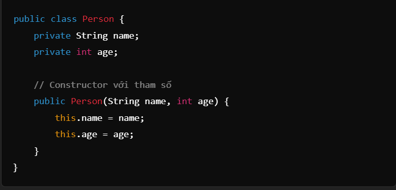
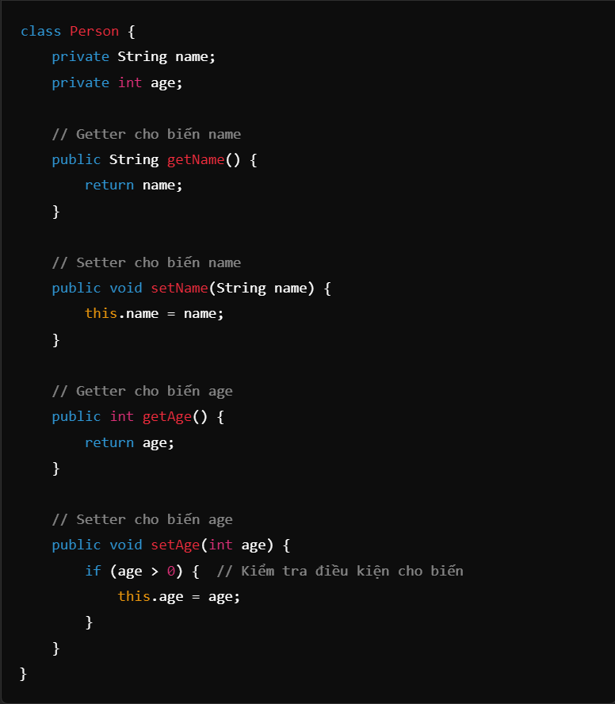
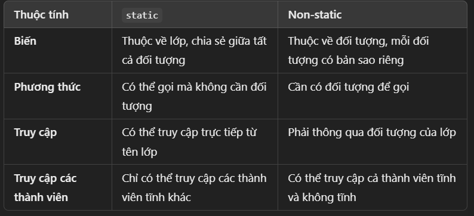

# **JAVA**

#**Nội dung**
1. **Khái niệm**
- là ngôn ngữ lập trình hướng đối tượng, đa nền tảng, có thể chạy trên nhiều hệ điều hành nhờ kiến trúc đặc biệt của nó. Java chính thức ra mắt vào năm 1955. Đặc điểm nổi bật của Java là ***WRITE ONCE, RUN ANYWHERE*** (viết một lần, chạy mọi nơi), nghĩa là Java có thể chạy trên nhiều hệ điều hành khác nhau mà không cần sửa đổi mã nguồn.

2. **Lý do ra đời của Java**
- Nhằm giải quyết một số hạn chế của các ngôn ngữ lập tình khác như C và C++. Ban đầu, Java được thiết kế để phát triển phần mềm cho các thiết bị thông minh như TV, nhưng sa dó được sử dụng rộng rãi cho các ứng dụng trên máy tính, di động, web.
- Một số lý do chính:
  + Tính di động(Portability): java chạy đc trên nhiều nên tảng khác nhau nhờ vào máy ảo Java
  + Tính bảo mật(Security) : Java có cơ chế bảo mật mạnh mẽ
  + Dễ học(Simplicity) : Java dễ học và dễ sử dụng hơn so với C++ vì loại bỏ một số tính năng phức tạp như con trỏ và đa kế thừa

3. **Cách Java hoạt động, điều xảy ra khi chạy      code Java(.java)**
- Quá trình có 3 bước chính:
    + Viết mã nguồn(Source code): viết mã nguồn trong file ".java"
    + Biên dịch(Compilation) : file ".java" được biên dịch bằng trình biên dịch "javac" thành bytecode và lưu trong file ".class"
    + Thực thi(Execution) : JVM (Java virtual machine) đọc và thực thi bytecode trong file ".class" trên nền tảng hệ điều hành bất kỳ

  Bytecode của Java là trung gian, nó không phải mã máy cụ thể của một hề điều hành nào, vì vậy JVM có thể chạy bytecode này trên nhiều nền tảng

4. **Cấu trúc một chương trình Java:**
- Gồm các phần sau:
 

+ **package(gói)**: mô tả không gian tên có chứa các lớp cả Java, sử dụng ký tự thường và dấu chấm để định nghĩa tên, chúng ta có thêm xem package như là một thư mục lón, còn class chính là các file trực thuộc thư mục
+ **import**: Từ khóa được sử dụng để xác định các class hoặc các package được sử dụng trong lớp này
+ **class**: Từ khóa nhằm để **định nghĩa lớp** của Java. Nó đứng trước khai báo tên lớp của Java. Ngoài ra còn có từ khóa public, từ khóa này xác định phạm vi truy cập của lớp. Đặc tính này chính là tính đóng gói trong OOP.
+ **variables**: **Biến** hay còn gọi là trường, chứa thông tin cụ thể liên quan tới các đối tượng là thể hiện của lớp.
+ **methods**: **Phương thức** hay còn gọi là **hàm** chứa các hành động thực thi của chính phương thức này.
+ **constructors**: **Hàm khởi tạo** của đối tượng. Hình dạng của đối tượng thể hiện ra sao sẽ phụ thuộc vào phương thức này.
    

5. **Package là gì?** 
- **Package (gói)** trong Java là một nhóm các loại class(lớp), interface(giao diện) và gói con tương tư nhau Package trong Java được chia làm 2 loại:
    + Package đã được dựng sẵn
    + Package do người dùng định nghĩa
- **Quy ước cách đặt tên** Package: các package được đặt tên theo thứ tự ngược lại với tên miền
- Các package khác nhau nhưng có thể có class trùng tên nhau. Nếu package khác nhau nhưng lại có các class trùng tên nhau thì khi sử dụng bắt buộc phải import đầy đủ tên package và cả tên class
- **Lợi thế** của việc sử dụng Package: Tổ chức các file (class, interface), việc tổ chức này theo một hệ thống giúp có thể dễ dàng phân loại file. Hay trong một trường hợp đặc biệt nào đó có những class trùng tên nhưng nằm trong các package khác nhau thì vẫn được chấp nhận. Khi tổ chức một project bạn có thể dễ dàng thấy được nó gồm những phần gì, thậm chí có thể biết được ai viết project này. Thông thường, người ta thường sử dụng domain hay tên công ty để làm tiền tố cho tên của package.

6. **Syntax cơ bản:**
> ***Khai báo biến nguyên thủy:***
 - Java có 8 kiểu dữ liệu nguyên thủy:
    + int: số nguyên
    + double: số thực
    + float: số thực
    + char: kí tự đơn
    + boolean: đúng/sai
    + byte, short, long: các biến số nguyên với phạm vi khác nhau

**-> **Chi tiết hơn về từng loại của biến nguyên thủy:

> ***Làm quen với vòng lặp:***
> 
 - **for loop**:

  

 - **while loop**:
   
 

 - **do-while loop**:
   
 

> ***Câu lệnh rẽ nhánh:***
 - **if-else:**
   
 

 - **switch-case:**
   
 

> ***Mảng:***
 - **Mảng** là tập hợp các giá trị cùng kiểu dữ liệu, được sắp xếp theo chỉ mục
   
  
 - **Hoặc** khai báo một mảng với kích thước cố định:
   
    

7. Tổng quan về ***Class*** và ***Object***:

    

- **Class** là một thực thể xác định hành vi mà một đối tượng có và sẽ có, nói cách khác một lớp là một bản thiết kế hoặc một tập hợp hướng dẫn để xây dựng các đặc tính của một đối tượng cụ thể. **Class** chứa các thuộc tính(biến) và phương thức(hàm). Cách tạo lớp trong Java như sau:
  
     
  
    + **class**: từ khóa để tạo một class
    + **<class_name>**:tên class bạn định tạo nó sẽ được viết liền và viết HOA chữ cái đầu tiên của từng từ (quy tắc PascalCase)
    + **field**: biến đối tượng
    + **method**: phương thức

- **Object** là một thực thể cụ thể được tạo từ class, mang các thuộc tính và hành vi đã định nghĩa trong class.

    
  
    + **<class_name>**: kiểu dữ liệu của đối tượng
    + **ReferenceVariable**: tên tham chiếu của đối tượng
    + **new**: từ khóa dùng tạo đối tượng
    + **<class_name>()**: class dùng để tạo bạn đối tượng 

8. ***Từ khóa this, constructor, access modifier, getter, setter, static***
> **từ khóa this:** tham chiếu đến đối tượng hiện tại của lớp.

   

> **Constructor:** phương thức đặc biệt để khởi tạo đối tượng.Constructor không có kiểu trả về và có cùng tên với lớp

   

> **Access Modifier:** Xác định mức độ truy cập của các lớp, phương thức, và biến (**public, private, protected**).
    - **public**: Có thể truy cập từ mọi nơi
    - **private**: Chỉ có thể truy cập từ bên trong lớp hiện tại
    - **protected**: Có thể truy cập từ cùng 1 lớp và các lớp trong cùng package.
    - **Mặc định**: có thể truy cập từ các lớp trong cùng package nhưng không từ bên ngoài package.     

> **Getter và Setter**
 - là các phương thức trong một lớp, được sử dụng để lấy và gán giá trị cho các biến thành viên của lớp một cách an toàn, đặc biệt khi các biến đó được khai báo là ***private***.
    + **Getter:** Dùng để lấy giá trị của một biến thành viên
    + **Setter:** Dùng để gán giá trị cho biến thành viên
    
     

> **Static:** Chỉ định một thành viên hoặc phương thức thuộc về lớp, không thuộc về đối tượng. Điều này có nghĩa là các thành viên và phương thức **static** có thể được truy cập mà không cần tạo đối tượng của lớp.
- Các trường hợp sử dụng **static**:
  + **Biến tĩnh** (static variable): Chỉ có một bản sao cho tất cả đối tượng của lớp.
  + **Phương thức tĩnh** (static method):Có thể gọi trực tiếp từ tên lớp mà không cần đối tượng
=> so sánh **static** với **non-static**:

   
